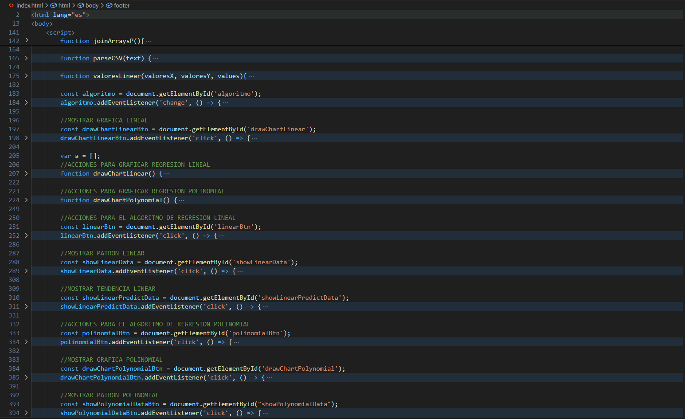
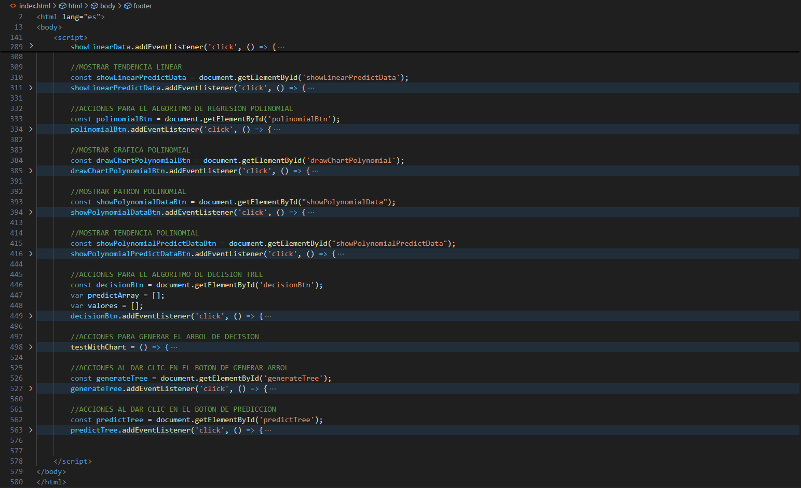

# Manual Técnico

## Introducción
El propósito de esta aplicación web es utilizar modelos de Inteligencia Artificial implementados en la librería **tytusjs**.

## Requisitos del Sistema
- Hardware necesario: no se necesita ningun elemento de hardware en especial, solamente un dispositivo con conexión a internet.
- Software necesario: navegador web actualizado. Las pruebas se realizaron en Google Chrome Versión 130.0.6723.92 (Build oficial) (64 bits).
- Entorno de desarrollo: Visual Studio Code Versión: 1.95.1.

## Lenguajes utilizados
Esta aplicación web se realizó utilizando los siguientes lenguajes:

- HTML
- JavaScript

La librería de JavaScript con los modelos a implementar es:
- [tytusjs - Pure Javascript Machine Learning Library](https://github.com/tytusdb/tytusjs).

Las librerías de JavaScript utilizadas para realizar gráficas y árboles son:
- [The Closure Library](https://www.gstatic.com/charts/loader.js)
- [Vis.js](https://cdnjs.cloudflare.com/ajax/libs/vis/4.21.0/vis-network.min.js)

## Descripción de los archivos
La estructura del repositorio es la siguiente:

- Directorio data: contiene los archivos csv utilizados para realizar las pruebas.
- Directorio dist: contiene la librería tytusjs, la cual contiene los modelos implementados en la aplicación.
- Directorio doc: contiene la documentación relacionada con la aplicación (Manual técnico y de usuario).
- Directorio img: contiene las imágenes utilizadas en la documentación.
- Archivo index.html: es el archivo que contiene la página web y el código en JavaScript para la implementación de los modelos seleccionados.

## Funciones implementadas
Las funciones implementadas son las siguientes:

- joinArraysP: une los arreglos que contienen los datos de entrenamiento con los arreglos generados al realizar las distintas predicciones del algoritmo de regresión polinomial.
- parseCSV: recibe el texto de un archivo csv cargado, y devuelve un array en el cual cada elemento del array representa una línea del archivo de texto. Cada elemento del arreglo es un arreglo también.
- valoresLinear: implementada para el algoritmo de regresión lineal. Recibe tres parámetros: **valoresX** es un arregle que va a contener los valores X del algoritmo, **valoresY** contendrá los valores Y del algoritmo, **values** es un arreglo que contiene tanto los valores X y Y del algoritmo. Esta función coloca los valores X y Y contenidos en values en sus respectivos arreglos.
- drawChartLinear: genera la gráfica correspondiente al algoritmo de regresión lineal.
- drawChartPolynomial: genera la gráfica correspondiente al algoritmo de regresión polinomial.
- testWithChart: esta función genera el árbol de decisión del algoritmo del mismo nombre, utilizando los datos de encabezado y entrenamiento desplegados en pantalla. 

El resto de funciones implementadas son agregadas como Listener de los botones disponibles para realizar las funciones de entrenamiento del modelo, realizar predicciones y mostrar las gráficas, patrones y modelos.

## Anexos
Información adicional, como diagramas y referencias.

