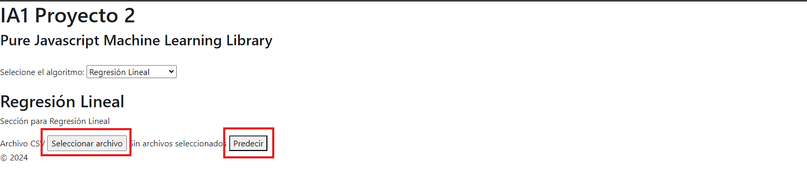

# Manual de Usuario

## Introducción
- **Descripción general de la aplicación:** esta aplicación web tiene como objetivo mostrar de una manera sencilla el funcionamiento de diversos algoritmos de Inteligencia Artificial que han sido implementados en la librería **tytusjs**.

- **Objetivo del manual:** el objetivo del presente manual es explicar de una manera sencilla el funcionamiento de esta aplicación web para que el uso de dicha aplicación no represente dificultad alguna para el usuario.

## Instalación
- **Requisitos del sistema:** Para que hacer uso de esta aplicación solamente se necesita de un dispositivo con un navegador web reciente y una conexión a internet.

## Uso del Software
- Pantalla de inicio: la pantalla de inicio de la aplicación es muy sencilla: solo consta de un título y una breve descripción de la aplicación. Se muestra un selector para que el usuario seleccione el algoritmo del cual desea ver una demostración. Por defecto se muestra seleccionado el primer algoritmo (Regresión Lineal).

- Navegación por la interfaz: la navegación es sencilla, para cambiar de algoritmo a visualizar, solamente es necesario cambiar la selección la opción de **Seleccione el algoritmo**.

- Funcionalidades principales: Las funcionalidades principales son la presentación de 3 algortimos, los cuales son:
    - **Regresión lineal:** este algoritmo es muy sencillo. Trata de encontrar una función lineal a partir de datos representados en un plano cartesiano (X,Y). Tomando esa función lineal, puede predecir un valor Y a partir de un valor x proporcionado. En este ejemplo se reciben pares de valores X,Y desde un archivo csv (sin encabezados de columna). La predicción se realiza sobre los valores X proporcionados.
    Los pasos a seguir son los siguientes: 
        - 1. En la opción **Seleccione el algoritmo** seleccione Regresión Lineal. Se mostrará en pantalla la opción para cargar un archivo csv. Cuando ya haya cargado un archivo csv, puede seleccionar la opción de **Predecir**.
        
        - 2. Si el archivo csv seleccionado tiene un formato válido, se procesarán los datos y se mostrarán los resultados en pantalla. Además se mostrarán las opciones de **Graficar**, **Mostrar patron** y **Mostrar tendencia**.
        
        
        
        

    - **Regresión polinomial:** este algoritmo es similar al de regresión lineal, con la diferencia que se puede buscar una función de grado 2 o mayor, con el objetivo de obtener una predicción final más cercana al valor real. Para este ejemplo, el archivo csv debe de contener valores X,Y que servirán para entrenar el modelo y además una columna adicional que contiene los valores X que se van a predecir. 
    Los pasos a seguir son los siguientes:
        - 1. En la opción **Seleccione el algoritmo** seleccione Regresión Polinomial. Se mostrará en pantalla la opción para definir el grado del polinomio (para el ejemplo está limitado entre 2 y 5, pero el código puede aceptar grados mayores) y la opción para cargar un archivo csv. Cuando ya haya cargado un archivo csv, puede seleccionar la opción de **Predecir**.
        
        - 2. Si el archivo csv seleccionado tiene un formato válido, se procesarán los datos y se mostrarán los resultados en pantalla. Además se mostrarán las opciones de **Graficar**, **Mostrar patron** y **Mostrar tendencia**.
        
        
        
        

    - **Decision tree:** Un árbol de decisión es un algoritmo de aprendizaje supervisado no paramétrico, que se utiliza tanto para tareas de clasificación como de regresión. Tiene una estructura jerárquica de árbol, que consta de un nodo raíz, ramas, nodos internos y nodos hoja. Para este ejemplo se necesita un archivo csv que incuya los encabezados de columna, para identificar facilmente los valores de las columnas. En este ejemplo la última columna es la variable que se va a predecir.
    Los pasos a seguir son los siguientes:
        - 1. En la opción **Seleccione el algoritmo** seleccione Decesion tree. Se mostrará en pantalla la opción para cargar un archivo csv. Cuando ya haya cargado un archivo csv, puede seleccionar la opción de **Entrenar**.
        
        - 2. Si el archivo csv seleccionado tiene un formato válido, se procesarán los datos y se mostrarán en pantalla los encabezados, los datos de entrenamiento y un área para ingresar los valores a utilizar para realizar la predicción. En el cuadro de texto donde se permite ingresar los datos para la predicción, ya se incluyen datos obtenidos aleatoriamente de los datos utilizados en el entrenamiento.
        También se muestran las opciones de **Mostrar patron del arbol** y **Predecir**.
        
        
        

## Solución de Problemas
- Problemas comunes y soluciones: 
    - Si no se procesa el archivo csv seleccionado, revisar que no existan en el archivo líneas en blanco, incluso al final del archivo. En la carpeta **data** puede encontrar los archivos csv utilizados en los ejemplos mostrados en el presente manual.
    - En ocasiones las gráficas pueden aparecer con un tamaño reducido. Volver a generar las gráficas debería de mostrarlas del tamaño adecuado. 

